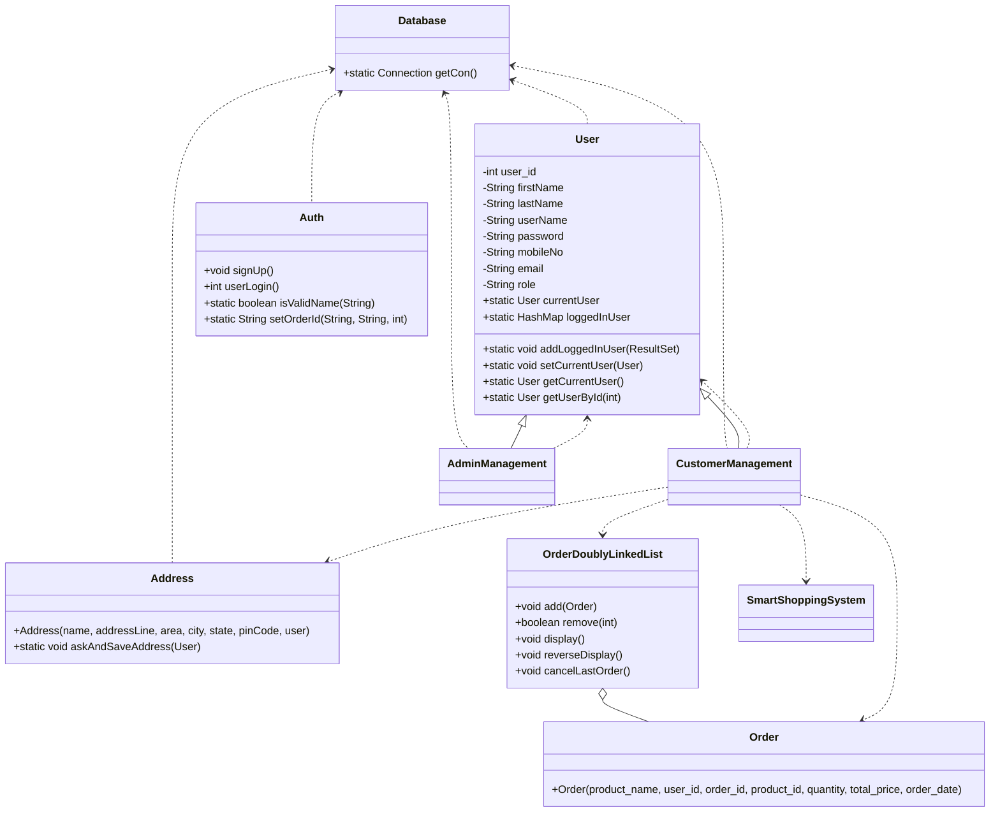
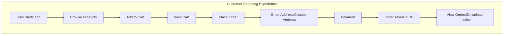
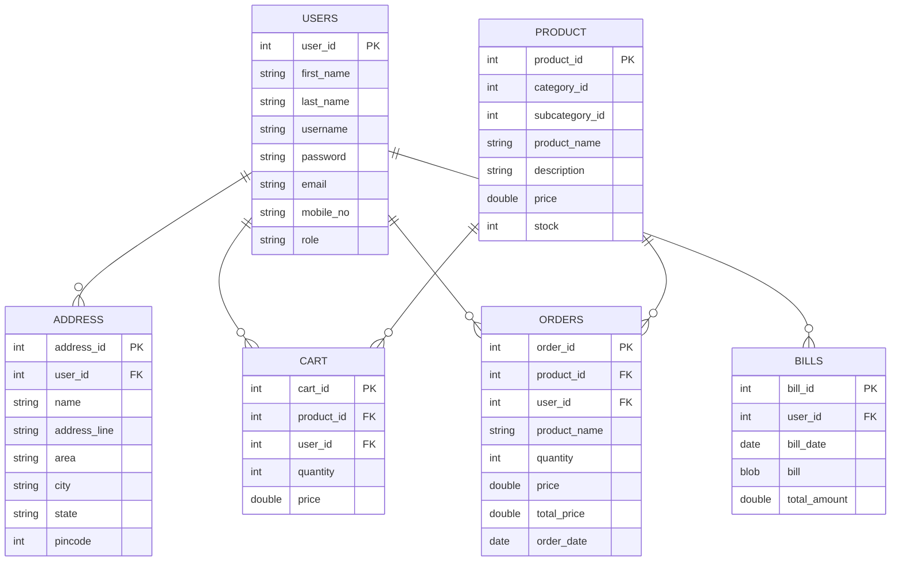
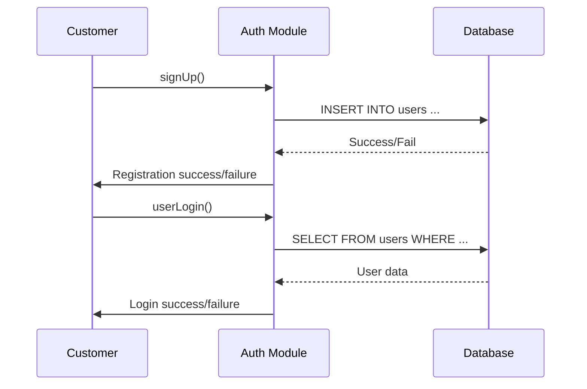
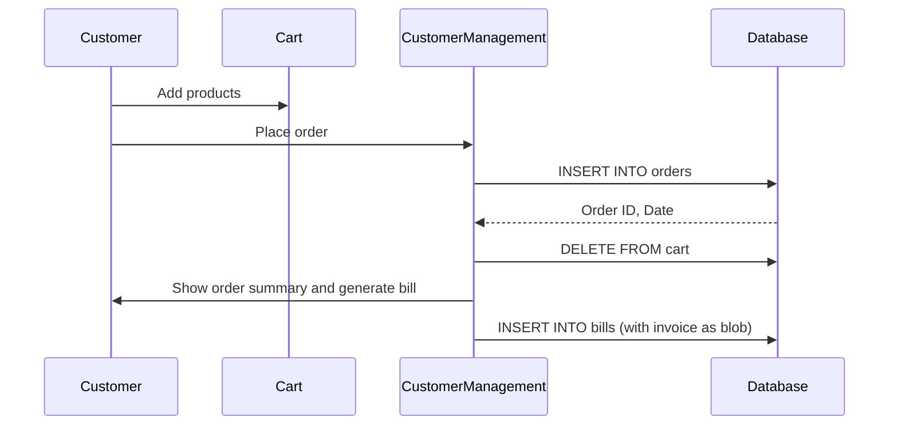

<div style="font-size: 1.15em">

Categories:
- Database
- Authentication
- Users
- Customer Management
- Orders
- Address
- Admin
- Analytics

# 🛒 Shopping Cart & Inventory Management System — Documentation

Welcome to the comprehensive documentation for the Shopping Cart & Inventory Management System!  
This project is a feature-rich Java application for managing users, products, orders, addresses, and predictive analytics in a retail scenario. The system supports both customer and admin roles, robust cart/order management, and smart reminders.

---

## 📚 Index

1. [System Overview](#system-overview)
2. [Architecture Diagram](#architecture-diagram)
3. [Database Connection (`Database.java`)](#databasejava)
4. [User & Authentication Modules](#user--authentication-modules)
    - [User Model (`User.java`)](#userjava)
    - [Authentication (`Auth.java`)](#authjava)
5. [Customer Management (`CustomerManagement.java`)](#customermanagementjava)
6. [Order Management](#order-management)
    - [Order Model (`Order.java`)](#orderjava)
    - [Order Doubly Linked List (`OrderDoublyLinkedList.java`)](#orderdoublylinkedlistjava)
7. [Address Management (`Address.java`)](#addressjava)
8. [Admin Management (`AdminManagement.java`)](#adminmanagementjava)
9. [Smart Shopping & Analytics (`SmartShoppingSystem.java`)](#smartshoppingsystemjava)
10. [Database Schema (ER Diagram)](#database-schema-er-diagram)
11. [Key Data Flows & Sequence Diagrams](#key-data-flows--sequence-diagrams)

---

## System Overview

- **Customers** can register, log in, browse products, manage their cart, place orders, manage addresses, and view/download invoices.
- **Admins** can manage the product catalog (add, update, delete, view products).
- **Smart analytics** provide purchase reminders and inactivity alerts using intelligent pattern recognition.

---

## Architecture Diagram



---

## Database.java

### Purpose

- **Manages the MySQL database connection** used throughout the application.

### Code Summary

- Loads the MySQL JDBC driver.
- Creates and returns a singleton `Connection` to the `Shopping_Cart` database.

### Example Usage

```java
Connection con = Database.getCon();
```

| Method | Description |
|--------|-------------|
| `getCon()` | Returns a JDBC `Connection` object to the MySQL database. Throws exceptions if connection fails. |

---

## User & Authentication Modules

### User.java

**Represents an application user and manages the logged-in user singleton.**

#### Key Responsibilities

- Holds user details (ID, name, role, etc.)
- Tracks the currently logged-in user.
- Provides getters/setters for user data.
- Supports assigning stats for smart analytics.

| Field         | Type          | Description                            |
|---------------|---------------|----------------------------------------|
| user_id       | int           | Unique DB ID for the user              |
| firstName     | String        | User's first name                      |
| lastName      | String        | User's last name                       |
| userName      | String        | Unique username                        |
| password      | String        | User password                          |
| mobileNo      | String        | Phone number                           |
| email         | String        | Email address                          |
| role          | String        | "customer" or "admin"                  |
| currentUser   | static User   | Singleton for the current logged-in user|
| loggedInUser  | static HashMap| All cached logged-in users             |

#### Example

```java
User user = new User(1, "John", "Doe", "johnd", "password", "john@example.com", "1234567890", "customer");
User.setCurrentUser(user);
```

---

### Auth.java

**Handles user authentication and sign-up.**

#### Features

- Validates user input during registration.
- Ensures unique usernames and correct email/mobile patterns.
- Stores users in the database.
- Handles session management by assigning an `orderId`.

#### Key Methods

| Method         | Description                                              |
|----------------|---------------------------------------------------------|
| `signUp()`     | Registers a new user after validation                   |
| `userLogin()`  | Authenticates a user and stores the session             |
| `isValidName()`| Checks that a name contains only alphabets              |
| `setOrderId()` | Generates a unique session order ID                     |

---

## CustomerManagement.java

**Central class for customer-facing features and user interactions.**

### Main Functionalities

- Add/manage user addresses.
- Browse products and categories.
- Manage shopping cart (add, view, place order).
- Profile management (update name, username, mobile, password, add address).
- View order history, download invoices.
- Smart reminders and inactivity alerts.
- Undo last order (via doubly linked list).

### Key Data Flows



### Example Menu

```text
1. 🔍 Browse Product
2. 🗂️ Categories
3. 🛒 View Cart
4. 👤 Profile Management
5. 📦 My Orders
6. ⚡ Process Order
7. 👁️ View Orders (Oldest → Latest)
8. 🔄 View Orders (Latest → Oldest)
9. ↩️ Undo Last Order
10. 🧾 Download Invoice
11. 🚪 Logout / Exit
```

---

## Order Management

### Order.java

- **Model for a single order record** (user_id, product_id, quantity, price, date, etc.)
- Used for both in-memory management and display.

| Field         | Type    | Description          |
|---------------|---------|----------------------|
| user_id       | int     | User who placed order|
| order_id      | int     | Unique order ID      |
| product_id    | int     | Product reference    |
| product_name  | String  | Name of product      |
| quantity      | int     | Quantity ordered     |
| total_price   | double  | Total price for order|
| order_date    | Date    | Date of the order    |

---

### OrderDoublyLinkedList.java

- **Custom doubly-linked list for storing Order objects.**
- Allows efficient undo of last order, traversal, and display.

| Method            | Description                                                    |
|-------------------|----------------------------------------------------------------|
| `add(Order)`      | Add a new order to the end of the list                         |
| `remove(int)`     | Remove a specific order by ID                                  |
| `display()`       | Display all orders (oldest → latest)                           |
| `reverseDisplay()`| Display all orders (latest → oldest)                           |
| `cancelLastOrder()`| Undo the last order, removing from both DB and in-memory list |

#### OrderNode (Inner Class)

- Holds a reference to an `Order` object and previous/next pointers.

---

## Address.java

- **Encapsulates a user's delivery address and handles saving to DB.**
- Static method `askAndSaveAddress` prompts the user and saves the address.

| Field         | Type    | Description                        |
|---------------|---------|------------------------------------|
| name          | String  | Recipient name                     |
| addressLine   | String  | Street address                     |
| area          | String  | Area/colony                        |
| city          | String  | City                               |
| state         | String  | State                              |
| pinCode       | int     | PIN/ZIP code                       |

---

## AdminManagement.java

**Admin dashboard for product management.**

### Features

- Add new products (name, desc, price, stock, category, subcategory)
- Update product price and stock
- View all products
- Delete products

| Method             | Description                                       |
|--------------------|---------------------------------------------------|
| `addProduct()`     | Insert a new product into the DB                  |
| `updateProduct()`  | Update price or stock of an existing product      |
| `viewProducts()`   | List all products                                 |
| `deleteProduct()`  | Remove a product by ID                            |

---

## SmartShoppingSystem.java

**Intelligent analytics and reminders for user purchase habits.**

### Features

- **Smart reminders:** Predict when a user is due to re-order a product, based on past intervals.
- **Inactivity alerts:** Warn users about products not ordered for a long time.
- **Stats inner class:** Tracks purchase days and predicts future orders.

#### Key Methods

| Method | Description |
|--------|-------------|
| `getSmartReminders(int userId)` | Returns reminders for predictable purchase intervals |
| `inactivityMessagesForAllProducts(int userId)` | Returns inactivity alerts for products not bought recently |
| `Stats` (inner class) | Tracks purchase days, predicts next purchase, checks inactivity |

---

## Database Schema (ER Diagram)



---

## Key Data Flows & Sequence Diagrams

### User Registration and Login



---

### Place Order and Bill Generation



---

## 📝 API Endpoints

> **Note:**  
> This is a Java Desktop application (not a web REST API).  
> There are NO HTTP routes, controllers, or endpoints exposed.  
> All database access is performed via JDBC and user interaction is via the console.  
> **No API blocks are generated for this project.**

---

## 📦 Package Structure

| Package/Folder             | Purpose                                 |
|---------------------------|-----------------------------------------|
| Database                  | Database connection utility             |
| Data_Structure            | Data structures (e.g., OrderDoublyLinkedList) |
| Modules.Address           | User address management                 |
| Modules.Auth              | Authentication logic                    |
| Modules.Users             | User base class                         |
| Modules.Users.CustomerManagement | Customer features (cart, order, address, billing, etc.)   |
| Modules.Users.AdminManagement    | Admin features (product management)      |
| Modules.Utils             | Smart analytics & utility functions     |

---

## 🧠 Smart Features

- **DoublyLinkedList:**  
  Used for efficient "undo last order" operations and order history navigation.
- **Smart Reminders:**  
  Uses past purchase intervals to predict when the user will likely need to re-order, sending reminders accordingly.
- **Inactivity Alerts:**  
  Detects if the user hasn't bought a product for a long time and recommends taking action.

---

## 🎨 Sample Console Outputs

```text
----- 🛍️ Welcome to Shopping Cart - Inventory Management System -----
1. 🔍 Browse Product
2. 🗂️ Categories
3. 🛒 View Cart
4. 👤 Profile Management
5. 📦 My Orders
6. ⚡ Process Order
7. 👁️ View Orders (Oldest → Latest)
8. 🔄 View Orders (Latest → Oldest)
9. ↩️ Undo Last Order
10. 🧾 Download Invoice
11. 🚪 Logout / Exit
Choose an option (1-11):
```

---

## 🏁 Summary

This documentation covers the code architecture, data flows, database relationships, and major features of the Shopping Cart & Inventory Management System.  
For further development, consider implementing a REST API layer or GUI for easier integration and extensibility.

---

**Happy Coding! 🚀**
</div>